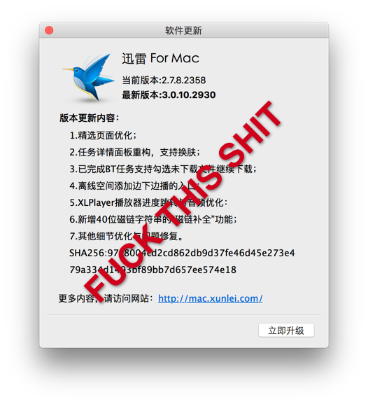

# ThunderTweak

A dynamic library tweak for Thunder([2.7.8.2358 beta](http://down.sandai.net/mac/thunder_dl2.7.8.2358_Beta.dmg)) macOS.

## Screenshot

## Feature

- Remove unnecessary plugins or bundles
- Remove auto update

## Usage

- `make install`
    - Install or Updrade the dylib
    - Remove unnecessary files
- `make uninstall`
    - Uninstall the dylib
    - Restore all files

## Development

**Requirement: Command Line Tools**

Run `xcode-select --install` to install Command Line Tools

- `make build` Build the dylib file to the same dicrectory
- `make debug` Build the dylib file and run `Thunder` with dynamic injection
- `make clean` Clean output files

## Dependency

- [insert_dylib](https://github.com/Tyilo/insert_dylib)

## License

The [MIT License](LICENSE).
